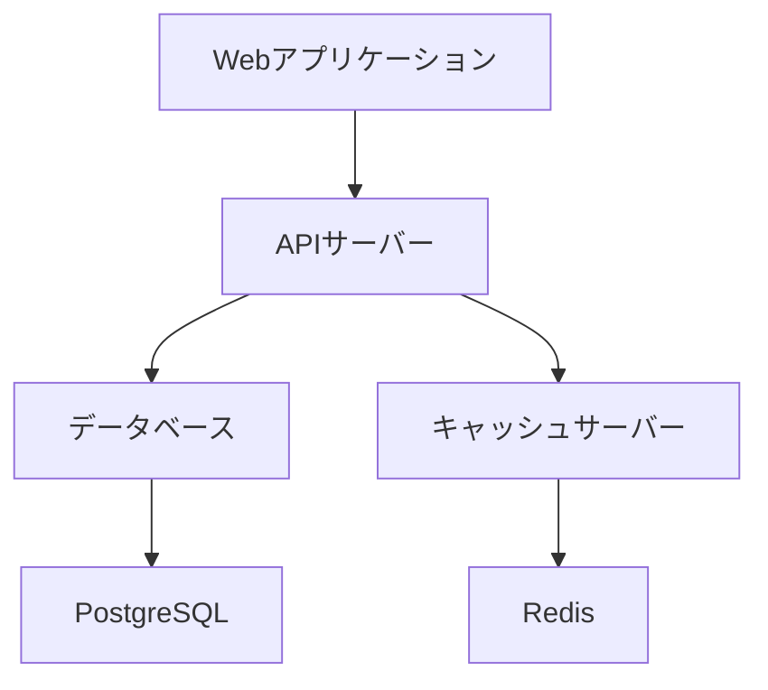
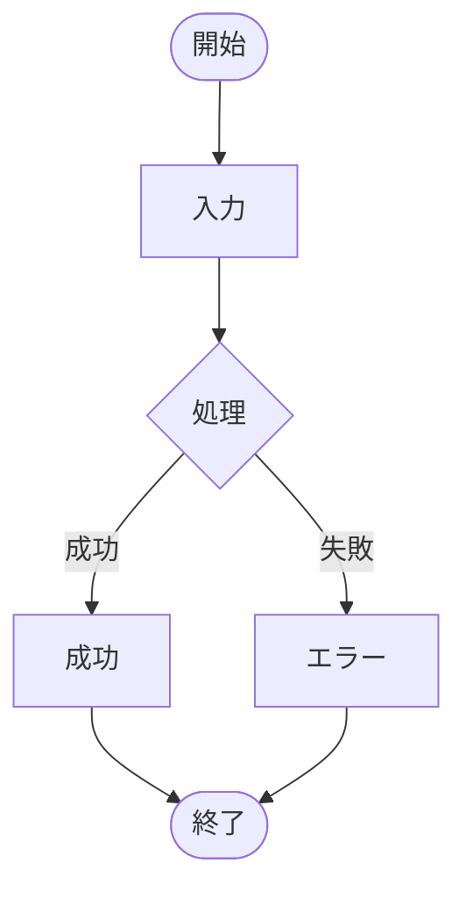
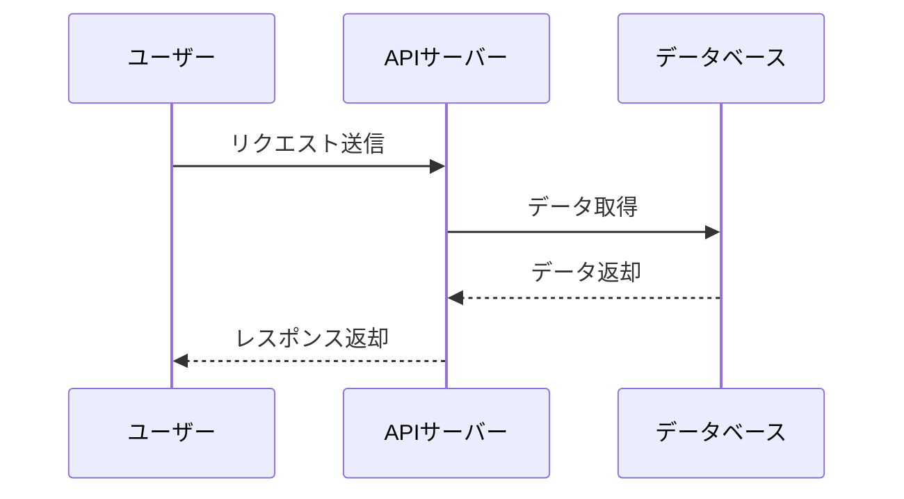

# システム概要

このドキュメントは、新システムの技術仕様について説明します。

## アーキテクチャ

### システム構成

システムは以下の3層で構成されます：

- **プレゼンテーション層**: Web UI
- **ビジネスロジック層**: API サーバー
- **データ層**: データベース

**システム構成図**



**フローチャート例**



**シーケンス図例**




### 技術スタック

#### フロントエンド

```javascript
// React コンポーネントの例
import React from 'react';

const UserProfile = ({ user }) => {
  return (
    <div className="user-profile">
      <h2>{user.name}</h2>
      <p>{user.email}</p>
    </div>
  );
};
```

#### バックエンド

```python
# Flask API の例
from flask import Flask, jsonify

app = Flask(__name__)

@app.route('/api/users')
def get_users():
    return jsonify([
        {'id': 1, 'name': '田中太郎'},
        {'id': 2, 'name': '佐藤花子'}
    ])
```

## データベース設計

### テーブル構成

| テーブル名 | 説明         | 主キー     |
| ---------- | ------------ | ---------- |
| users      | ユーザー情報 | user_id    |
| posts      | 投稿データ   | post_id    |
| comments   | コメント     | comment_id |

### ER図

> データベースの関係性については、別途ER図を参照してください。

## API仕様

### 認証API

#### エンドポイント

- `POST /api/auth/login` - ログイン
- `POST /api/auth/logout` - ログアウト
- `GET /api/auth/profile` - プロフィール取得

#### レスポンス例

```json
{
  "status": "success",
  "data": {
    "user_id": 123,
    "username": "tanaka",
    "email": "tanaka@example.com"
  }
}
```

## セキュリティ対策

### 認証・認可

1. JWT トークンによる認証
2. ロールベースアクセス制御（RBAC）
3. APIレート制限

### データ保護

- 個人情報の暗号化
- HTTPS通信の強制
- SQLインジェクション対策

## 運用・保守

### 監視項目

- サーバーリソース使用率
- レスポンス時間
- エラー発生率

### バックアップ

- データベース: 日次バックアップ
- ファイル: 週次バックアップ
- 復旧テスト: 月次実施
