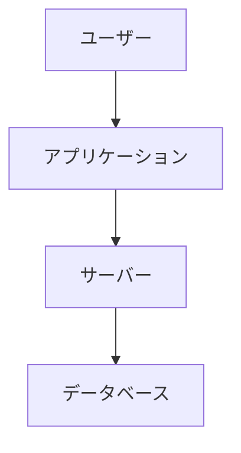

# ドキュメントタイトル

この文書は、スタイルシートの動作確認用に作成されたMarkdownのサンプルです。

## 概要

以下のような内容を含み、レンダリング結果を視覚的に確認します。

- 見出し（H1～H4）
- 箇条書き、番号付きリスト
- 引用
- コードブロック（インライン／ブロック）
- テーブル
- 注釈スタイル（.note など）
- Mermaidグラフ

## 見出しの確認

### H3の見出し

ここでは段階的な見出しのスタイルを確認します。

#### H4の見出し

段落や装飾の違いを見てみましょう。

## リストの確認

- 箇条書き1
  - ネスト項目A
  - ネスト項目B
- 箇条書き2

1. 番号リスト
2. 番号リスト
   1. ネストリスト

## 引用

> これは引用の例です。背景色と左線で装飾されます。

## テーブル

| 項目 | 説明    | 備考 |
| ---- | ------- | ---- |
| A    | テスト1 | OK   |
| B    | テスト2 | NG   |

## コード

### インラインコード

`console.log("Hello, world!");`

### ブロックコード

```python
def hello():
    print("Hello, world!")
```

## 注釈スタイル

<div class="note">
これはNoteスタイルの注釈です。補足情報やヒントに使います。
</div>

<div class="warning">
これはWarningスタイルの注釈です。注意喚起に使います。
</div>

<div class="info">
これはInfoスタイルの注釈です。補足的な情報に使います。
</div>

<div class="tip">
これはTipスタイルの注釈です。ちょっとしたコツなどに使います。
</div>

## Mermaidグラフ


